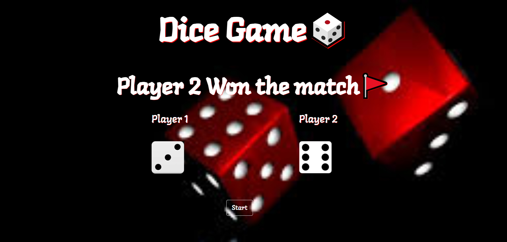

<h1>Dice Game 🎲</h1>

In this game, there are two dice. These two dice are rolled simultaneously by the players. The player who got a greater number of dice will win.🏆 

Just click on start button and it will start game

<h4>Languages Used</h4>
<ul>
    <li>HTML</li>
    <li>CSS</li>
    <li>Javascript</li>
</ul>

<h4>Libraries Used</h4>
<ul>
    <li>Bootstrap(Frontend library)</li>
</ul>

